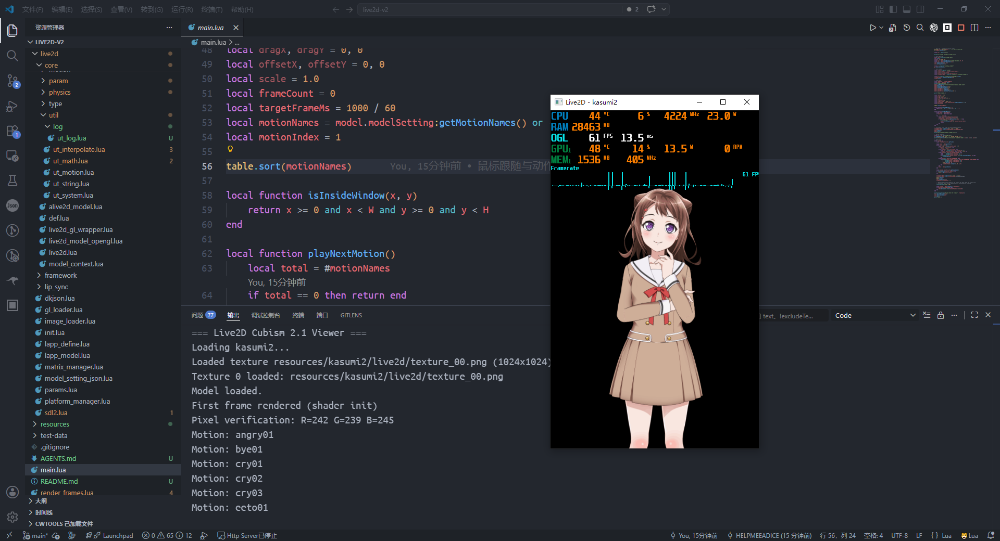

# Live2D v2 in LuaJIT

<p align="center">
  <a href="https://github.com/HELPMEEADICE/Live2D-v2-Lua"></a>
  <a href="https://github.com/HELPMEEADICE/Live2D-v2-Lua/blob/main/LICENSE"></a>
  <a href="https://github.com/HELPMEEADICE/Live2D-v2-Lua/stargazers"></a>
  <a href="https://github.com/HELPMEEADICE/Live2D-v2-Lua/network/members"></a>
  <a href="https://luajit.org/"></a>
  <a href="https://www.live2d.com/"></a>
  <a href="https://github.com/HELPMEEADICE/Live2D-v2-Lua"></a>
</p>

> キラキラドキドキ！Live2D Cubism 2.1 SDK，LuaJIT 纯享版。

将 [EasyLive2D/live2d-v2](https://github.com/EasyLive2D/live2d-v2) 从 Python 完整重构为 Lua，**零 C 编译，纯 FFI**。只要你有 LuaJIT + SDL2.dll + 一颗对二次元赤诚的心，就能跑。

如果问我为什么选 Lua——大概就和香澄在仓库找到 Random Star 一样，有些事情不需要理由。（其实是因为 Python 性能太差了。）

> ⚠️ `main.lua` 只是一个演示。使用 Lua 编码的真正目的是：这个高性能（比 Python 高到不知道哪里去了）的 Live2D v2 渲染核心，可以像胶水一样轻松嵌到任何语言里——不管是 C++ 一个 `lua_pcall`，还是 Python 一个 `lupa`，随你喜欢。
> 
> 🔌 **Python 调用方法详见 [Embedded2Python.md](Embedded2Python.md)**，内含 lupa / ctypes / 子进程三种接入方案、PySide6 完整示例及常见问题排查。

> 🌸 这是一个粉丝向的移植项目，本仓库源于 [EasyLive2D/live2d-v2](https://github.com/EasyLive2D/live2d-v2)（MIT），并由 Python 重构为 Lua。
> 
> 🤖 特别鸣谢 **DeepSeek V4 Pro**（主力重构编码）与 **GPT 5.5**（疑难杂症 BUG 修复）——没有这两位无声的共犯，这个小破项目现在还困在 import 地狱里。AI 调用总花费约 **5 美元**，大概是两瓶波子汽水的钱。



---

## 前置条件

- **LuaJIT 2.1+**（需要 FFI）
- **SDL2.dll** 在 `PATH` 或当前目录
- Windows（`opengl32.dll` + `wglGetProcAddress`）

Linux/macOS 暂时不支持，因为 OpenGL 扩展加载是 Windows 特化的。PR welcome。

## 快速开始

```bash
luajit main.lua
```

弹窗 400×650，点击角色切动作，按 Esc 退出。

```bash
luajit render_frames.lua
```

## 入口脚本

| 脚本 | 功能 |
|------|------|
| `main.lua` | 交互式查看器，鼠标跟随 + 点击切换动作 + 自动呼吸/眨眼 |
| `render_frames.lua` | 离线渲染 20 帧并输出 BMP 到 `frames_output/` |
| `live2d_embed.lua` | 无窗口渲染核心模块，供宿主语言嵌入调用 |
| `examples/pyside6_lupa_kasumi2.py` | Python 接入完整示例 (PySide6 + lupa) |
| `simple.lua` | ~~施工中~~ 别用 |

## 默认角色

`kasumi2`——是的，就是那个香澄，BanG Dream! Poppin'Party 的主唱兼吉他手。模型文件在 `resources/kasumi2/kasumi2.model.json`。

> どうせなら、星の鼓動でいこう！ 🎸✨

## 项目结构

```
live2d/
  init.lua                 # facade
  core/                    # Cubism Core 2.1 移植
  framework/               # Cubism Framework 移植
  sdl2.lua                 # SDL2 FFI 绑定（纯 Lua 声明 + 加载）
  gl_loader.lua            # OpenGL 扩展加载器（wglGetProcAddress）
  platform_manager.lua     # 文件 I/O 抽象层
  lapp_model.lua           # 高级模型接口（JSON / 动作 / 物理）
```

模块命名沿用了原版 C++ 类层次结构（如 `live2d.core.live2d`），便于对照官方 SDK 文档。

## 已知坑位

- **GC Step 是生存必需品**：每次 `model:Draw()` 都会分配临时 FFI 顶点缓冲区。没有 `collectgarbage("step", 200)` 的话，在没有垂直同步的驱动上，内存会直接炸给你看。
- **OpenGL 扩展加载是 Windows 专供**：`gl_loader.lua` 里硬编码了 `wglGetProcAddress`。想移植到别的平台？先改这里。
- **脚本必须在 repo 根目录运行**：每个入口脚本里都内联了 `package.path` 的扩展，不在 root 跑就找不到模块。
- **没有测试、没有 CI、没有构建系统**：这是纯 Lua 项目，没有 `make`、`cmake`、`npm` 那些玩意儿。跑就完了。

## 致谢

- [EasyLive2D/live2d-v2](https://github.com/EasyLive2D/live2d-v2)
- [DeepSeek V4 Pro](https://www.deepseek.com)
- [GPT 5.5](https://chatgpt.com/codex/cloud)
- [OpenCode](https://opencode.ai)
